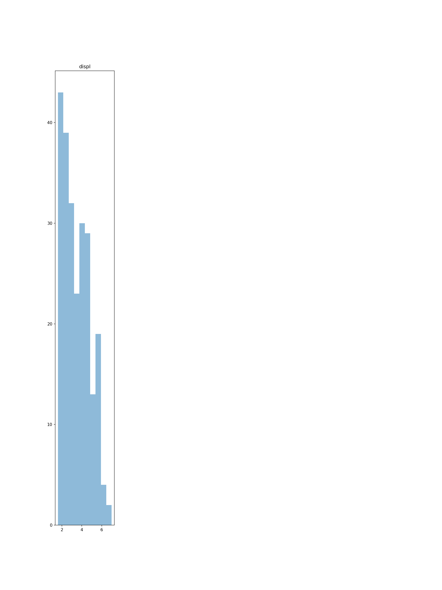

# eda-utils
helper functions for exploratory data analysis (EDA)

----
docs can be found at:
https://davidfurrer.github.io/edautils/

-----

## Example usage

```python
import edautils

edautils.plot_numerical(df)
```


