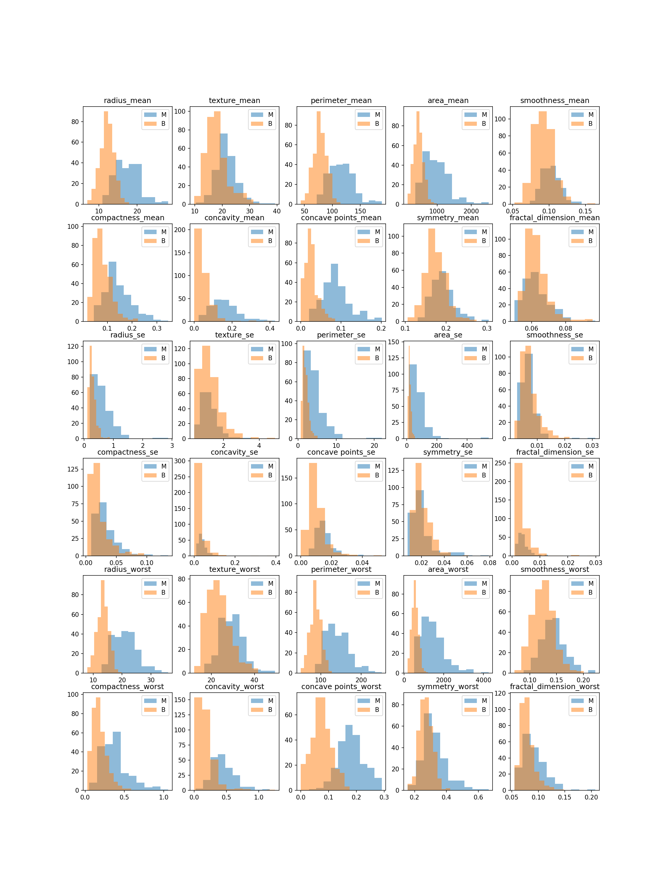

# edautils
helper functions for exploratory data analysis (EDA)

## Installation

```
git clone git@github.com:davidfurrer/edautils.git
pip install -e edautils
```


## Example usage

```python
import edautils

edautils.plot_numerical(df, num_cols = 5, target_col = 'diagnosis')
```




```python
edautils.plot_numerical(df, num_cols = 5)
```


